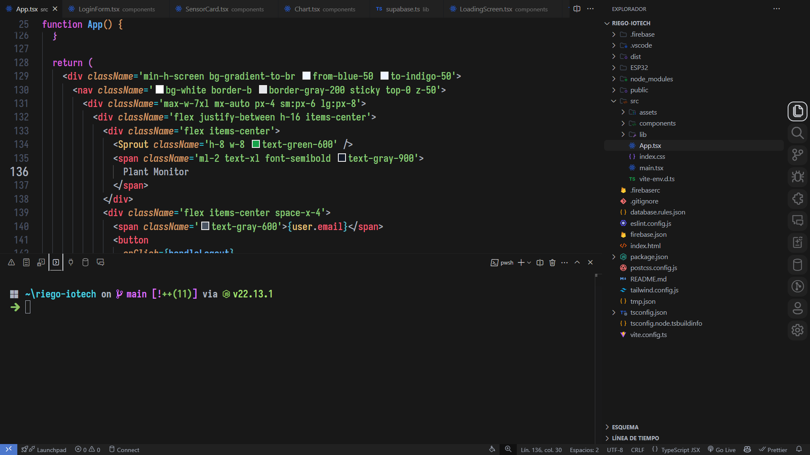

# One Darker Pro



## Installation

1. Open **Visual Studio Code**.
2. Go to the **Extensions Marketplace** (`Ctrl+Shift+X`).
3. Search for **One Darker Pro Theme** and click **Install**.
4. Activate the theme:
   - Press `Ctrl+Shift+P` → **"Preferences: Color Theme"** → Select **One Darker Pro**.

## Suggest Editor Settings

```json
{
  "editor.fontFamily": "Iosevka Nerd Font",
  "editor.fontSize": 20,
  "editor.fontLigatures": true,
  "editor.fontWeight": 600
}
```
